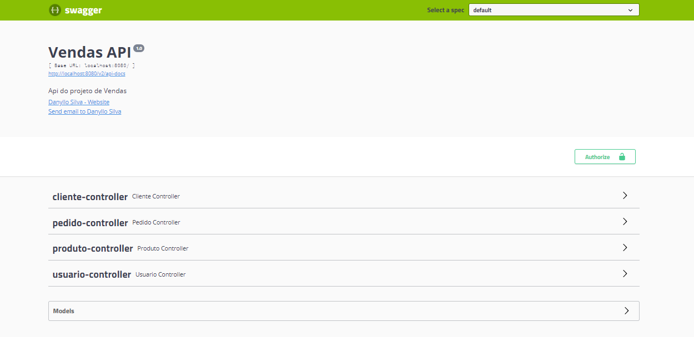

# Spring Boot Expert: JPA, RESTFul API, Security, JWT e Mais

Descrição: Do Zero ao Expert em Spring Boot e todo o ecossistema Spring. Guia Completo e atualizado.

Link: https://www.udemy.com/share/102JD0AEQdcFtQQng=/

## 💻 Projeto do curso

API de cadastro de Clientes, Produtos, Pedidos e Usuários com CRUD completo (busca, listagem, inserção, atualização e exclusão.

## :camera: Demonstração

## :rocket: Conceitos e tecnologias

✔️ Spring Boot

✔️ API RestFul

✔️ Spring Data - JdbcTemplate e Repository

✔️ Validação bom Bean Validation

✔️ Banco de dados H2Database e MYSQL

✔️ Lomboks

✔️ DTO (Data Transfer Object)

✔️ Internacionalização

✔️ Testes de APIs com Postman

✔️ Spring Security e JWT

✔️ Documentação de APIs com Swagger

✔️ Build e Deploy (JAR e WAR)

## :phone: Contato

 Linkedin [https://www.linkedin.com/in/danyllo-valente-da-silva-3569b460](https://www.linkedin.com/in/danyllo-valente-da-silva-3569b460)

:postbox: E-mail [danyllo.dvs@gmail.com](danyllo.dvs@gmail.com)
